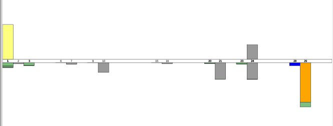
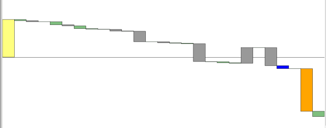

# Finalytics

    Does your bank provide a CSV-export functionality for your bank-account?   
    Ever wondered what this data might look like?   
    Ever wondered how much of your money you spend on what?   
    You don't like Excel?   

    --> Then Finalytics might be for you!   

**Finalytics** is an application which takes a bunch of finance CSV-files and visualizes the transactions.   
The aim is, to give you a good overview of what is going on with your money by visualizing the data nicely.

## Features included

* load multiple finance-csv-files (overlapping transactions allowed, won't lead to duplicates)
* specification of your csv-format
* responsive charts

## Charts
### Simple bar-chart
   
The simple bar-chart visualizes all transactions from your csv-files. 
For every day in a given month the withdrawals are stacked and drawn 
underneath, the incoming money transactions are stacked and drawn
above each day.   
Colors are used from your *spec.edn*

### Waterfall-chart
  
The waterfall-chart visualizes each transaction after another. Each bar of a transaction is painted at the position of the current total balance.
A waterfall-chart of a month starts at the balance from the end of previous month and at 0 if it is the first month rendered.

## Technologies used

* Clojure
* Clojurescript
* D3.js
* bootstrap


## Getting started
1. Create a folder *A* for your csv-files
2. Put your finance-csv files into folder *A*
3. Create a 'spec-edn' file which should look something like this and is a valid configuration for your csv-format:   
     ```edn
        {:columns         [[:a {:type   :date
                                :format "dd.MM.yyyy"}]
                           [:b {:type   :number
                                :locale #locale java.util.Locale/GERMAN}]
                           nil
                           :client]
         :date-column     :a
         :tids            {{:client "^.*clienta.*"} :clienta
                           {:client "^.*clientb.*"} :clientb}
         :classifications {:food {:tids  [:clientb]
                                  :color "#123456"}
                           :gas  {:tids  [:clienta]
                                  :color "#000000"}}}
    ```
        
    * **columns**: a vector of columns-specifications. Types: *Date*, *Number*, *String* or *nil* for ignoring a column
    * **date-column**: points to the name of the column which holds the transaction date
    * **tids**: used for transaction identification (regex-query-map -> tid)
    * **classification**: groupings of tids (e.g. supermarkets -> \[tesco, sainsburys\])
    
4. Start the application with 'lein run'
5. Open http://localhost:8080/csv-config in a browser
6. Specify csv-folder and your spec-file location
7. Click 'Load folders'

## Upcoming changes / TODOs
* waterfall-chart
* some crazy chart for the classifications
* fancy d3 stuff
* cljs-tests
* refactor meta-data function
* **run** task  which compiles cljs->js before start
* remove main.js after **run** task has been implemented
* uberjar which can be started + configured
* lein ancient as dep + updated deps + deps-status visible here
* travis tests visible in this file

## Contributor

Kai Brandes

## License
Apache License
